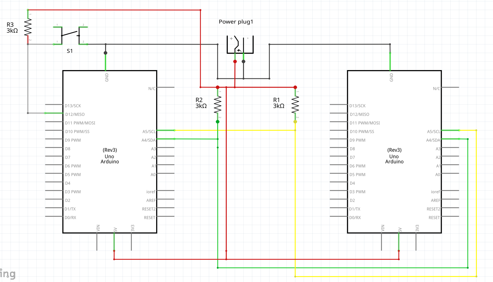
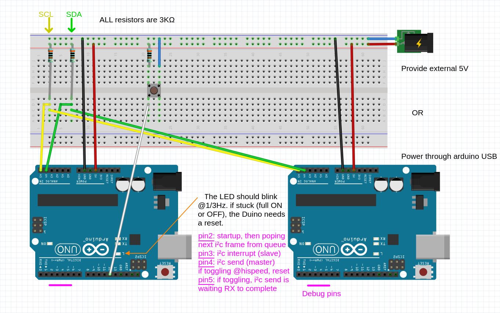

# i²c lamp emulator

This code / setup allows to emulate the Regent lamp / module i²c control stream.

Both elements can be replaced by their emulation counterpart, they can even talk to each other.

Terminology : in the code and in this doc as well, we sometimes call the i²c control module "the Genie" / "Genius" (obviously named from the Alladin's Tale in "Arabian Nights").

## Physical setup

The schematics is simple enough as following:


Here is a reference implementation on a breadbord:


"debug pins" are output that can be useful when debugging using a logic analyzer.

## Software

Despite using Arduino hardware, this project is plain AVR-C, i.e. you should see no call to any Arduino API method.
Since the file are named `*.c` (**NOT** `*.ino`), it implies that Arduino.h is NOT included automatically, nor the Arduino init functions (so it is likely for most of the Arduino API to be defective. For instance `millis()` won't work as the timer0 is not up and running... But don't worry I provide a `timer_init()` / `timer_get_ms()` replacement :) )

### Dependencies

You will have to manually clone those two library repositories, used by this project.

* i²c AVR lib : git@github.com:JohannCahier/avr-i2c
* AVR UART : git@github.com:JohannCahier/avr_uart.git

If you already have an AVR arduino lib dir, you may want to add those libs to it. Otherwise, just create a ./libs (With '.' being the directory where you cloned this project).

### Build system

#### Toolchain

Here is the list of minimal packages needed in order to build the project and flash the board (for the Arch Linux dstro) :

* avr-gcc
* avr-libc
* avr-binutils
* avrdude
* arduino-avr-core

In doubt, just install the Arduino IDE (often the `arduino` package, in many distros), it will draw all needed dependencies for you. Unless like me, you want a Java-free workstation !

#### Arduino-Makefile

The provided Makefile actually includes the template provided by : git@github.com:sudar/Arduino-Makefile.git

Clone it somewhere and update the following path:

* Where you cloned the library in `USER_LIB_PATH`
* Where Arduino-Makefile is installed (`include`, last line)
* ARDMK_VENDOR must hold anything useful to make the `/usr/share/arduino/hardware/$ARDMK_VENDOR/avr/` path valid. By default, it's empty, but this value is needed given how ArchLinux packages `arduino-avr-core`.

You may also want to tweak the `MONITOR_PORT`, `BOARD_TAG`, ...

When everything is configured, up and running, building and flashing the project is as easy as :

```bash
$ make upload
```

For the "genie" version, and :
```bash
$ IS_LAMP=yes make upload
```

**NOTE:** If you previously built the Lamp and want the Genie or vice-versa, please wipe out the `build-${BOARD_TAG}/` directory. I should have implemented storing the macro in a header file (that be `touch`ed), instead of passing it a gcc -D... parameter. ALAS !

#### Arduino IDE

It should be feasible to build and upload the project using Arduino IDE.
If you want to do so, please work out for yourself the way to add both libraries, and other Arduino IDE config details.
